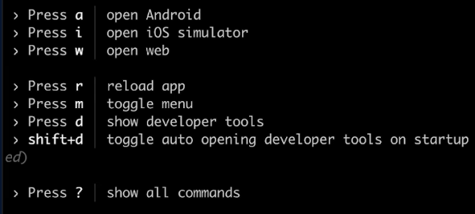

# pokedex

Pokedex utiliza la api de pokemon para mostrar las pokemonCard.
Algunas de las features que tiene son:
* Flujos de navegación con React Navigation.
* Creacion de componentes con interfaces nativas multiplataforma.
* Consumo de APIs REST
* Renderizado de listas con FlatList.
* Creacion de estilos con StyleSheet.
* Almacenamiento local de favoritos usando AsyncStorage.
* Creacion de formularios, Integracion con Formik y Yup para manejar formularios de autenticación. 

## install
* `yarn install` para instalar las dependecias
* `yarn start` para levantar metro
* presionar `a` para abrir en android o presionar `i` para abrir en ios

* `yarn android` para iniciar la app

## Licencia
MIT